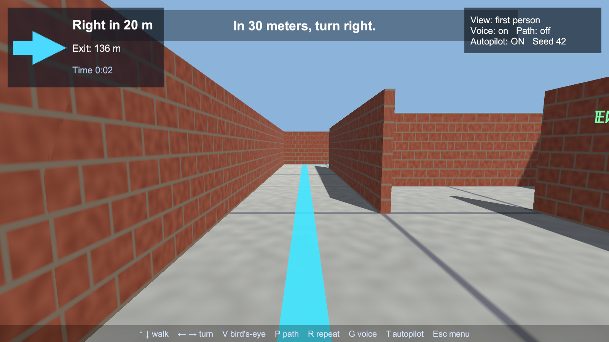
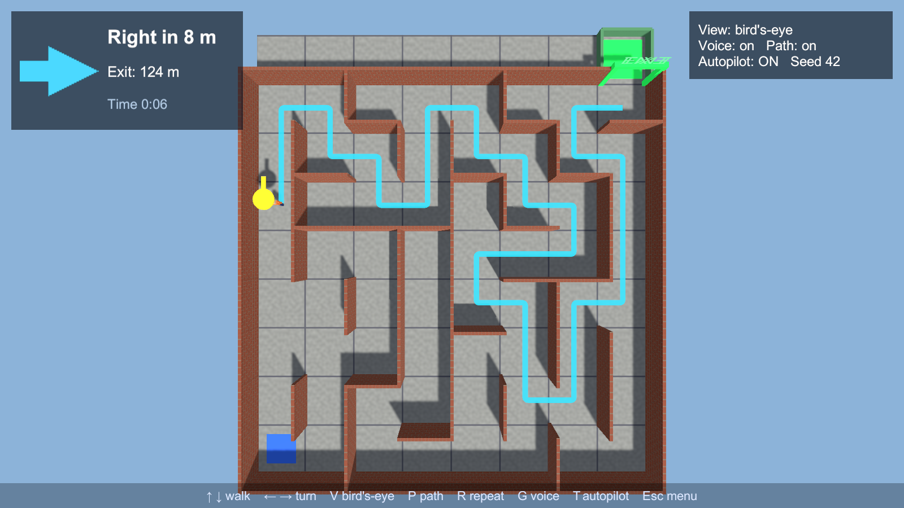
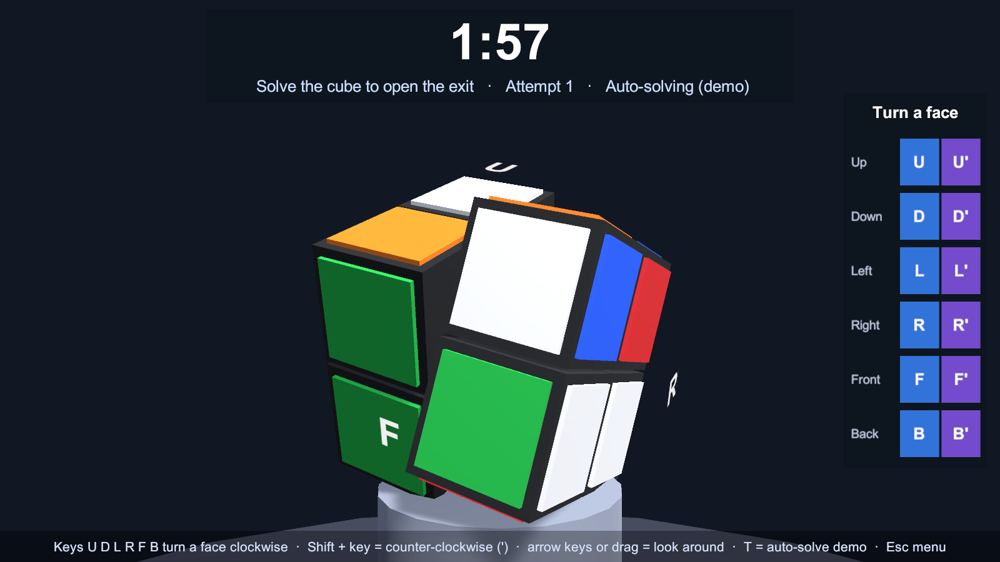

# Maze GPS Navigator — Unity 6.3 · Desktop + Meta Quest 3

*Created by Isac Artzi*

This is a demo activity. You walk a humanoid character through a procedurally generated maze. An **A\* pathfinder** plans the route to the exit, and a **car-GPS style voice** guides you there: *"In 10 meters, turn left."* … *"Turn left."* … *"Recalculating."* Press one key to go from the first-person view to a bird's-eye view. The same project runs on the desktop and on a **Meta Quest 3**.

**The twist:** the exit is locked. When you reach it you must solve a **2×2×2 Rubik's cube in 2 minutes**. If the time runs out, you're sent back to the start of the maze to walk it again.





---

## 1. Quick start

1. Open the folder in **Unity 6.3** (tested with 6000.3.6f1). Install the **Android Build Support** module in Unity Hub to build for Quest.
2. Run the menu command **Maze ▸ 1. Set Up Project**. It creates the two scenes, the build list, the input settings and the OpenXR/Quest settings. The command is safe to run again.
3. Open `Assets/Scenes/Main.unity` and press **Play**.

The voice clips are already in `Assets/Resources/Voice`. To use a different voice, run **Maze ▸ 2. Generate Voice Clips**. It uses the macOS `say` command on a Mac and Windows SAPI on Windows. The voice name is stored in `EditorPrefs` under the key `MazeNav.Voice`.

## 2. Controls

| Action | Desktop | Quest 3 |
|---|---|---|
| Walk forward / back | ↑ ↓ (or W S) | Left stick |
| Turn | ← → (or A D) | Right stick (45° snap), or turn your head |
| First person ⇄ bird's-eye | **V** (or Tab) | **B** or **Y** |
| Show the A\* route on the floor | P | A |
| Repeat the last instruction | R | X |
| Voice on / off | G | — |
| Autopilot (the GPS drives) | T | — |
| New maze (after you finish) | Enter | A |
| Back to the start screen | Esc | Menu button |

### The exit cube (2×2×2, 2-minute limit)

| Action | Desktop | Quest 3 |
|---|---|---|
| Turn a face clockwise | U D L R F B keys, or the on-screen buttons | Right stick ← → picks a face (it lights up), **A** turns it |
| Turn a face counter-clockwise (') | **Shift** + key, or the ' buttons | **B** |
| Look around the cube | Arrow keys, or drag with the mouse | Left stick |
| Auto-solve (demo) | T | (autopilot only) |

Letters float next to the faces you can see. *Clockwise* always means clockwise as you look straight at that face.

Pick the difficulty on the start screen: **Easy** is a 3-move scramble, **Medium** 5 and **Hard** 9. In VR, use the right stick. Voice cues at 1:00, 0:30 and 0:10.

## 3. Desktop or Quest?

The start screen has two buttons, **Play on Desktop** and **Play on Meta Quest**.

- **Windows:** *Play on Meta Quest* starts OpenXR at runtime and streams to the headset over **Quest Link / Air Link**.
- **macOS:** Quest Link doesn't exist on the Mac. In the Editor, *Play on Meta Quest* leaves Play mode, builds the APK and installs it on a **USB-connected** Quest. You can run the same steps from **Maze ▸ 5. Build & Install to Quest**.
- **On the Quest:** the app starts straight in VR. The start panel floats in front of you. Press **A** or the trigger to start.

Headset checklist: turn on Developer Mode in the Meta Horizon phone app, connect the USB-C cable, then choose **Allow USB debugging** inside the headset.

Menu reference:

| Menu item | What it does |
|---|---|
| Maze ▸ 3. Build Desktop | Builds `Builds/Desktop/MazeNavigator.app` (or `.exe` on Windows) |
| Maze ▸ 4. Build Quest APK | Builds `Builds/Quest/MazeNavigator.apk` (OpenXR + Meta Quest feature, IL2CPP ARM64, Vulkan, API 32+) |
| Maze ▸ 5. Build & Install to Quest | Builds the APK, runs `adb install -r` and launches it |

## 4. How it works

The scenes are nearly empty on purpose. `MainMenu` and `MazeGame` build everything in code, so each script can be read top to bottom.

```
Assets/Scripts/Core/            ← pure C#, unit-tested, no scene needed
  MazeGrid.cs                   cells + wall bit-flags (N=1, E=2, S=4, W=8)
  MazeGenerator.cs              recursive backtracker + "braiding" (loops)
  AStarPathfinder.cs            A* with a Manhattan heuristic
  RoutePlanner.cs               path → next maneuver (left/right/straight/U-turn) + distance
  Cube2Model.cs                 2×2×2 cube logic: integer rotations, scramble, solved check
Assets/Scripts/Game/
  MainMenu.cs                   start screen, desktop/Quest choice
  MazeGame.cs                   builds the level, handles keys/buttons
  MazeBuilder.cs                grid → walls, floor, exit gate (procedural textures)
  BlockyHumanoid.cs             humanoid made of cubes + procedural walk cycle
  PlayerController.cs           CharacterController movement, VR stick, autopilot
  ViewController.cs             first-person ⇄ bird's-eye (desktop glide, VR teleport)
  GpsNavigator.cs               re-plans on every cell change, decides what to say
  VoiceGuide.cs                 plays clips, anti-nag timer, subtitles
  VoicePhrases.cs               every sentence the GPS can say (single source of truth)
  CubeView.cs                   8 cubies + stickers, animated face turns, face labels
  CubeChallenge.cs              puzzle stage, 2-minute clock, controls, win → finish, lose → back to start
  CameraRig.cs, XRSupport.cs    desktop camera / XR rig, OpenXR start-stop, Touch controllers
  Hud.cs, UIFactory.cs          GPS panel, subtitles, finish panel (uGUI built in code)
Assets/Editor/
  MazeProjectSetup.cs           the Maze menu + command-line entry points
  Tests/MazeLogicTests.cs       edit-mode tests
```

### 4.1 Maze generation: recursive backtracker

Every cell starts with all four walls. Push the start cell onto a stack. Then repeat: look at the cell on top of the stack. If it has unvisited neighbours, pick one at random, knock down the wall between the two cells, and push the neighbour. If it has none, pop the stack. The result is a **perfect maze**: a spanning tree of the grid, with exactly one path between any two cells.

After that, about 8% of the interior walls are removed at random. This **braiding** creates loops, so a wrong turn can be recovered in more than one way and the GPS has something to *recalculate*.

### 4.2 Pathfinding: A\*

A\* always expands the open cell with the smallest

  **f(n) = g(n) + h(n)**, where *g* = steps taken from the start and *h* = |dx| + |dy| (Manhattan distance to the exit).

In a maze you can only move N, E, S or W, so Manhattan distance never overestimates the true distance. That makes the heuristic *admissible*, and A\* is guaranteed to return a shortest path. The unit test `AStarFindsAShortestLegalPath` checks this against breadth-first search.

### 4.3 From a path to spoken directions

A path is a sequence of unit moves. A **turn** is the first cell where the move direction changes. The 2D cross product of the incoming direction **a** and the outgoing direction **b** gives the side of the turn:

  a.x · b.y − a.y · b.x  > 0 → **left**, < 0 → **right**

The GPS also compares the route's first direction with where you are facing, using a signed angle. More than 50° off means *turn left/right*. More than 130° off means *make a U-turn*.

Each turn is announced twice: once from a distance, rounded to 5 m (*"In 10 meters, turn left"*), and again at the corner (*"Turn left"*).

Each time you enter a new cell, A\* runs again from that cell. If the new cell isn't the one the old route expected, you hear *"Recalculating."*

### 4.4 The cube: 8 cubies and integer rotations

A 2×2×2 cube has no centre pieces, only 8 corner **cubies**. Each cubie stores its corner position **p** (every coordinate is ±1) and where its local x, y and z axes point now. All of these are integer vectors.

A face turn picks the 4 cubies with **p · n > 0**, where **n** is the face's outward normal. It rotates their position and their axes by 90°:

  **v′ = n (n·v) ± n × v**

This is Rodrigues' formula with cos 90° = 0 and sin 90° = ±1. The arithmetic is all integers, so the cube never drifts out of alignment.

A sticker's colour is the colour of the face it pointed at when the cube was solved. The cube is **solved** when each face shows one colour. The test compares the 4 stickers on each face, so a cube that is solved but turned as a whole still counts.

Scrambles use only R, U and F, like official 2×2 scrambles. On a 2×2, L is the same as R′ followed by turning the whole cube. Mixing opposite faces could produce "fake" scrambles like L R′, which is just the solved cube rotated.

The animation parents the 4 cubies to a pivot and rotates it. When the turn ends, every cubie snaps to the exact position the model computed.

### 4.5 Two platforms, one project

- **XR Plug-in Management + OpenXR.** Android: *Initialize XR on Startup* is on, with the Meta Quest feature and the Oculus Touch profile. Desktop: XR stays off until the player chooses VR.
- **The camera rig** is a plain `Camera` on the desktop. In VR it is `XR Rig › Camera Offset › Camera` with an Input System `TrackedPoseDriver`.
- **The bird's-eye view** is different on each platform. On the desktop the camera glides up above the maze. In VR you're teleported onto a glass platform high above the maze. Moving a VR camera smoothly makes people sick, so the switch is instant.

## 5. Tests and automation

```bash
UNITY=/Applications/Unity/Hub/Editor/6000.3.6f1/Unity.app/Contents/MacOS/Unity
$UNITY -batchmode -projectPath . -runTests -testPlatform EditMode -testResults results.xml
$UNITY -batchmode -quit -projectPath . -executeMethod MazeNav.EditorTools.MazeProjectSetup.BuildDesktopCLI
$UNITY -batchmode -quit -projectPath . -buildTarget Android -executeMethod MazeNav.EditorTools.MazeProjectSetup.BuildQuestCLI
```

The built game also accepts these arguments for smoke tests: `-autostart -autopilot -quitOnArrive -seed 42 -size 10 -screenshots <folder>`. With them, the game skips the menu, lets the GPS drive, saves screenshots, and quits once it reaches the exit. With autopilot on, the cube solves itself by undoing every move.

To test the failure path, add `-cubeGiveUp -cubeTime 8 -quitAfter 60`. The autopilot then leaves the cube alone, the 8-second clock runs out, and the player is sent back to the start. `-scramble N` sets the scramble length.

## 6. Deliverables (activity)

- A short screencast: finish one maze in first person, following only the voice. Then switch to bird's-eye with the route shown.
- 3–5 bullets: what you changed, what works, what doesn't.

**Ideas to extend it:**

1. Replace the linear open list in A\* with a binary heap, and time both versions on an 18×18 maze.
2. Add *"Keep going straight for N meters"* after each turn.
3. Swap `BlockyHumanoid` for a rigged Mixamo character with an Animator.
4. Add a compass rose to the HUD, or spatial audio: put the voice at the next turn instead of in your ear.
5. Compare Dijkstra, greedy best-first and A\*. Draw each one's visited cells in bird's-eye view.
6. Replace the "undo everything" auto-solve with a real solver: breadth-first search over R, U and F from the scrambled state. Every 2×2 position can be solved in at most 11 quarter turns.
7. Show a hint (the next move of the optimal solution) in exchange for 15 seconds off the clock.
